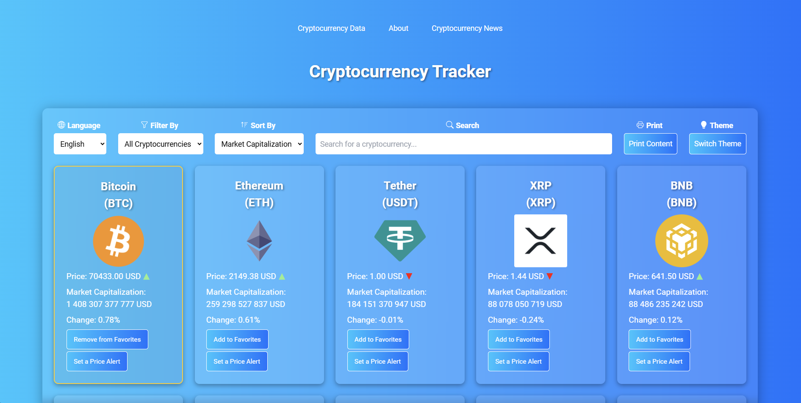

# Cryptocurrency Tracker

&nbsp;&nbsp;**Welcome to the Cryptocurrency Tracker project!** This web application is designed to provide users with real-time tracking of cryptocurrency prices, making it an important tool for investors, traders, and enthusiasts. With its intuitive interface and powerful features, the Cryptocurrency Tracker helps you make informed decisions in the trading. Whether you're an experienced trader optimizing your portfolio or a newcomer exploring the crypto market, this tool is designed to meet your needs.

&nbsp;&nbsp;**<a href="https://primesolar.github.io/cryptocurrency-tracker/" target="_blank" rel="noopener noreferrer">Navigate the Crypto Market with Confidence: Accurate Data Anywhere, Anytime</a>**

- [Cryptocurrency Tracker](#cryptocurrency-tracker)
  - [Interface](#interface)
  - [Features](#features)
  - [Technologies Used](#technologies-used)
  - [Localization \& Internationalization](#localization--internationalization)
    - [Multi-Language Support](#multi-language-support)
    - [Localization Strategy](#localization-strategy)
    - [Why This Matters](#why-this-matters)
  - [Getting Started](#getting-started)
  - [Usage](#usage)
  - [Acknowledgments](#acknowledgments)
  - [Support My Work ☕](#support-my-work-)
  - [Contact Me](#contact-me)

## Interface

&nbsp;&nbsp;The interface combines visually appealing design with intuitive navigation, enabling you to access real-time cryptocurrency data. Every component is strategically placed to support quick decision-making and market analysis.

<!--prettier-ignore-->

<p align="center"><em>The Cryptocurrency Tracker Interface</em></p>

## Features

- **Real-Time Data**: stay updated with live cryptocurrency prices, ensuring you never miss a market movement. The application fetches data at intervals to provide the most accurate information. This enables traders to react quickly to price fluctuations and make timely decisions.
- **Latest Cryptocurrency News**: stay informed with the latest news articles related to cryptocurrencies, helping make timely and informed trading decisions.
- **Multi-Language Support**: the application offers multilingual support, including **English, Spanish, French, Portuguese, Serbian, and Arabic**, making it inclusive and accessible with seamless language switching while maintaining full functionality.
- **Searching**: quickly find specific cryptocurrencies using the search bar.
- **Filtering and Sorting**: easily filter and sort cryptocurrencies based on various criteria, such as market capitalization, prices, and price changes, allowing you to quickly find the information you need for informed decision-making.
- **Theme Toggle**: implement light and dark mode themes with persistent user preferences, improving readability across varying lighting conditions and reducing eye strain for extended trading sessions.
- **Printing**: generate and print professional market reports with current prices and news summaries, enabling you to document market conditions and trading decisions.
- **User-Friendly Interface**: the intuitive interface allows you to easily search for your favorite cryptocurrencies and view detailed price information, including price changes and market capitalization.
- **Responsive Design**: the application is fully optimized for all devices, ensuring a seamless experience whether you're on a desktop, tablet, or smartphone.

## Technologies Used

  - **JS (JavaScript)**: a foundational programming language for web development. It powers dynamic web interactions, enables complex client-side functionality, supports modern web standards, and facilitates responsive, interactive user experiences through event-driven programming and asynchronous operations.
  - **jQuery**: a fast and lightweight JavaScript library that simplifies HTML document traversing and event handling. jQuery allows for easy manipulation of the DOM (Document Object Model). It also provides methods for handling events, making it straightforward to create the responsive user interface that can react to actions.
  - **API**: Cryptocurrency Tracker utilizes the CoinGecko API for fetching real-time cryptocurrency data, ensuring accurate and up-to-date information.
  - **RSS**: the application integrates CoinTelegraph's RSS feed to provide the latest cryptocurrency news.
  - **HTML5**: a markup language for structuring the application, ensuring semantic markup and improved SEO.
  - **CSS3**: a style sheet language for styling and layout, including responsive design techniques that improve your experience across various devices.
  - **Tailwind CSS**: a framework used for consistent UI construction. It provides a collection of CSS utility classes, supports responsive design, and is highly configurable.

## Localization & Internationalization

### Multi-Language Support

&nbsp;&nbsp;**Cryptocurrency Tracker** is designed for a global audience with support for multiple languages. The application dynamically adapts content - including the project name, navigation, and interface text - based on user language preference.

### Localization Strategy

&nbsp;&nbsp;When users select a language, the experience is localized through JavaScript-driven
dynamic DOM updates. Language preference is persisted in local storage
for consistent experience across sessions. This approach respects user preferences and
demonstrates professional internationalization practices used by global tech companies
(Apple, Google, Microsoft). The language collection may be expanded. If you'd like to
contribute translations or suggest a language, please open an issue or contact me.

**Implementation**

- Language selector in the main interface.
- Dynamic content rendering based on user selection.
- Consistent localization across UI components.
- Professional translations maintaining brand voice.

### Why This Matters

&nbsp;&nbsp;By localizing the content, the application provides
an authentic experience for multiple language communities. This approach shows
professional internationalization practices and respects user preferences.

## Getting Started

&nbsp;&nbsp;To get started with the Cryptocurrency Tracker, follow these steps:

1. Ensure you have Git installed on your system. If you haven't installed it yet, you can find detailed installation instructions and download options at the <a href="https://github.com/git-guides/install-git" target="blank" rel="noopener noreferrer">Install Git</a> page. This resource provides step-by-step guidance for various operating systems. Once Git is installed, open a terminal window and **run the following command** to clone the repository:

```bash
git clone https://github.com/PrimeSolar/cryptocurrency-tracker.git
```

2. **Navigate to the project directory** on your local device.

3. **Open the `index.html` file** in your web browser.

## Usage

&nbsp;&nbsp;Once the application is open, you can:

- **Search for Cryptocurrencies**: type the name of the cryptocurrency you want to track in the search bar to find and view its information.
- **View Price Information**: access detailed information for each cryptocurrency, including the current price, market capitalization, and percentage changes in price.
- **Add to Favorites**: easily add cryptocurrencies to your favorites list for quick access to the ones you track most frequently.
- **Set Price Alerts**: receive notifications when a cryptocurrency reaches a specified price, helping you make timely trading decisions.
- **Stay Updated with Cryptocurrency News**: overview the latest cryptocurrency news that help you stay informed and make better trading decisions.
- **Toggle Themes**: click the theme toggle button to switch between light and dark modes, allowing for a comfortable viewing experience tailored to your preference.
- **Responsive Design**: enjoy a seamless experience across various devices, whether you're using a desktop, tablet, or smartphone.

## Acknowledgments

- **Data Providers**: special thanks to CoinGecko for providing the cryptocurrency data that powers this application and to CoinTelegraph for their extensive cryptocurrency news.
- **Inspiration**: inspired by the growing interest in cryptocurrency and the need for appropriate tools that empower users to make informed financial decisions.

## Support My Work ☕

If you enjoy my project and would like to support my work, consider buying me a coffee! Your contributions help me stay energized and motivated to create even more amazing content.

Every cup of coffee you buy not only fuels my passion but also allows me to dedicate more time to developing innovative projects and sharing knowledge. Whether it's a small gesture or a generous contribution, every bit is greatly appreciated!

**Click the image to support my work:**

<a href="https://coff.ee/cocacola" rel="noopener noreferrer">
  
</a>

Thank you for your support! Together, we can create something wonderful! 💖

**Copyright Notice**

Copyright © Vladislav Kazantsev
All rights reserved.
This repository contains the intellectual property of Vladislav Kazantsev, including the code and related files.
You are welcome to clone this repository and use the code for exploratory purposes.
However, unauthorized reproduction, modification, or redistribution of this code (including cloning of this repository or altering it for activities beyond exploratory use) is strictly prohibited.
Code snippets may be shared only when the original author is explicitly credited and a direct link to the original source of the code is provided alongside the code snippet.
Sharing links to the repository or its files is permitted, except when directed toward retrieval purposes.
Any form of interaction with this repository or its files is strictly prohibited when facilitated by the code, except when such interaction is for discussion or exchange purposes with others.
This copyright notice applies globally.
Email address for inquiries about collaboration, usage outside exploratory purposes, or permissions: [hypervisor7@pm.me](mailto:hypervisor7@pm.me)

<a name="contact-me"></a>

## Contact Me

&nbsp;&nbsp;LinkedIn [@PepsiCo](https://www.linkedin.com/in/PepsiCo/)


