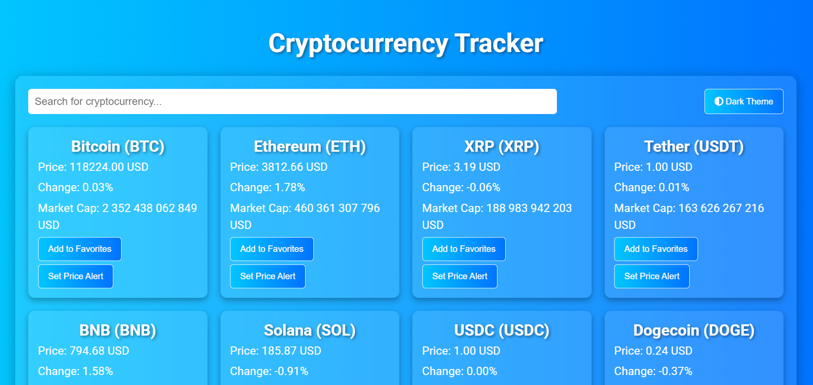

# Cryptocurrency Tracker

&nbsp;&nbsp;Welcome to the Cryptocurrency Tracker project! This web application is designed to provide users with real-time tracking of cryptocurrency prices, making it an essential tool for investors, traders, and enthusiasts. With its intuitive interface and powerful features, the Cryptocurrency Tracker helps you make informed decisions in the trading. Whether you're a seasoned investor or just starting, this tool is designed to meet your needs.

- [Cryptocurrency Tracker](#cryptocurrency-tracker)
  - [Interface](#interface)
  - [Features](#features)
  - [Technologies Used](#technologies-used)
  - [Getting Started](#getting-started)
  - [Usage](#usage)
  - [Acknowledgments](#acknowledgments)
  - [Support My Work ☕](#support-my-work-)
  - [Contact Me](#contact-me)

## Interface

&nbsp;&nbsp;The interface is designed to be user-friendly and visually appealing.

<!--prettier-ignore-->

<p align="center"><em>The Cryptocurrency Tracker Interface</em></p>

## Features

- **Real-Time Data**: stay updated with live cryptocurrency prices, ensuring you never miss a market movement. The application fetches data at intervals to provide the most accurate information.
- **User-Friendly Interface**: the intuitive design allows users to easily search for their favorite cryptocurrencies and view detailed price information, including price changes and market capitalization.
- **Theme Toggle**: switch between light and dark themes for a personalized viewing experience, catering to user preferences and enhancing usability, especially in different lighting conditions.
- **Search Functionality**: quickly find specific cryptocurrencies using the search bar.
- **Responsive Design**: optimized for all devices, ensuring a seamless experience whether you're on a desktop, tablet, or smartphone.

## Technologies Used

- **HTML5**: for structuring the web application, ensuring semantic markup and improved SEO.
- **CSS3**: for styling and layout, including responsive design techniques that enhance user experience across devices.
- **JavaScript**: for dynamic content updates and user interactions, providing a smooth and interactive experience.
- **APIs**: utilizes the CoinGecko API for fetching real-time cryptocurrency data, ensuring accurate and up-to-date information.

## Getting Started

&nbsp;&nbsp;To get started with the Cryptocurrency Tracker, follow these steps:

1. Ensure you have Git installed on your system. If you haven't installed it yet, you can download it from [git-scm.com](https://git-scm.com/). Once Git is installed, open a terminal window and **run the following command** to clone the repository:

```bash
git clone https://github.com/PrimeSolar/cryptocurrency-tracker.git
```

2. **Navigate to the project directory** on your local device.

3. **Open the `index.html` file** in your web browser.

## Usage

&nbsp;&nbsp;Once the application is open, you can:

- **Search for Cryptocurrencies**: type the name of the cryptocurrency you want to track in the search bar to find and view its information.
- **View Price Information**: access detailed information for each cryptocurrency, including the current price, market capitalization, and percentage changes in price.
- **Add to Favorites**: easily add cryptocurrencies to your favorites list for quick access to the ones you track most frequently.
- **Set Price Alerts**: receive notifications when a cryptocurrency reaches a specified price, helping you make timely trading decisions.
- **Toggle Themes**: click the theme toggle button to switch between light and dark modes, allowing for a comfortable viewing experience tailored to your preference.
- **Responsive Design**: enjoy a seamless experience across various devices, whether you're using a desktop, tablet, or smartphone.

## Acknowledgments

- **Data Provider**: special thanks to CoinGecko for providing the cryptocurrency data that powers this application.
- **Inspiration**: inspired by the growing interest in cryptocurrency and the need for appropriate tools that empower users to make informed financial decisions.

## Support My Work ☕

&nbsp;&nbsp;If you enjoy my project and would like to support my work, consider buying me a coffee! Your contributions help me stay energized and motivated to create even more amazing content.

&nbsp;&nbsp;Every cup of coffee you buy not only fuels my passion but also allows me to dedicate more time to developing innovative projects and sharing knowledge. Whether it's a small gesture or a generous contribution, every bit is greatly appreciated!

**Click the image to support my work:**

<a href="https://coff.ee/cocacola">
  
</a>

&nbsp;&nbsp;Thank you for your support! Together, we can create something wonderful! 💖

<a name="contact-me"></a>

## Contact Me

&nbsp;&nbsp;LinkedIn [@PepsiCo](https://www.linkedin.com/in/PepsiCo/)


